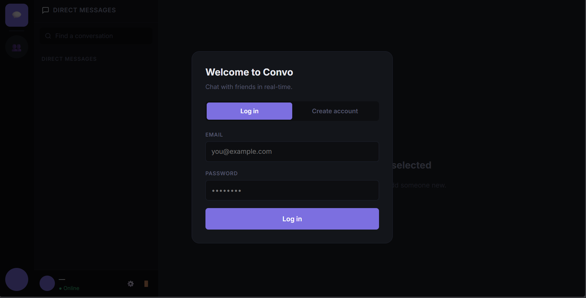
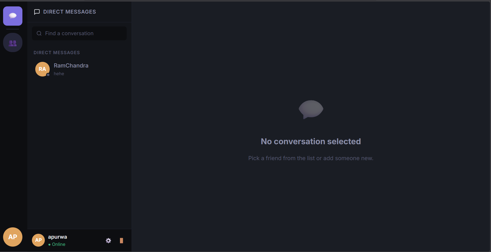
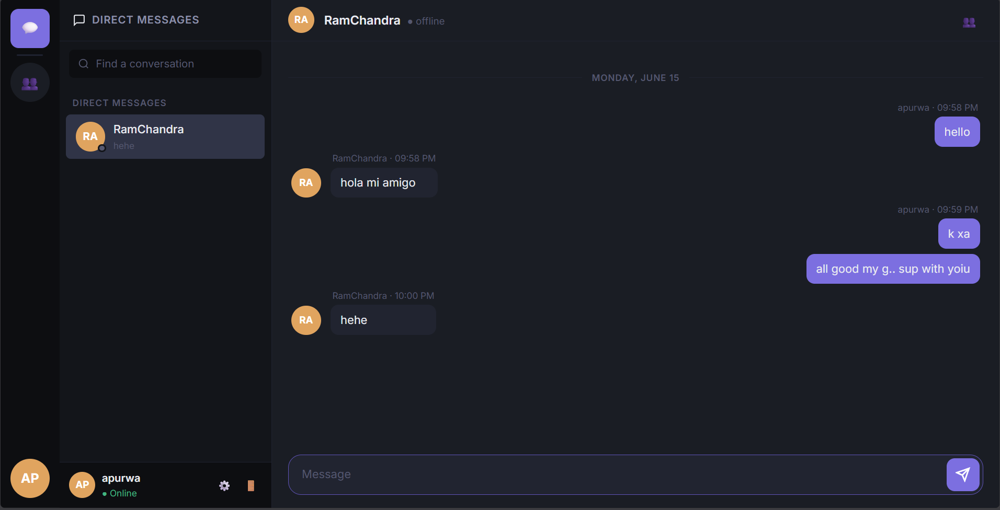
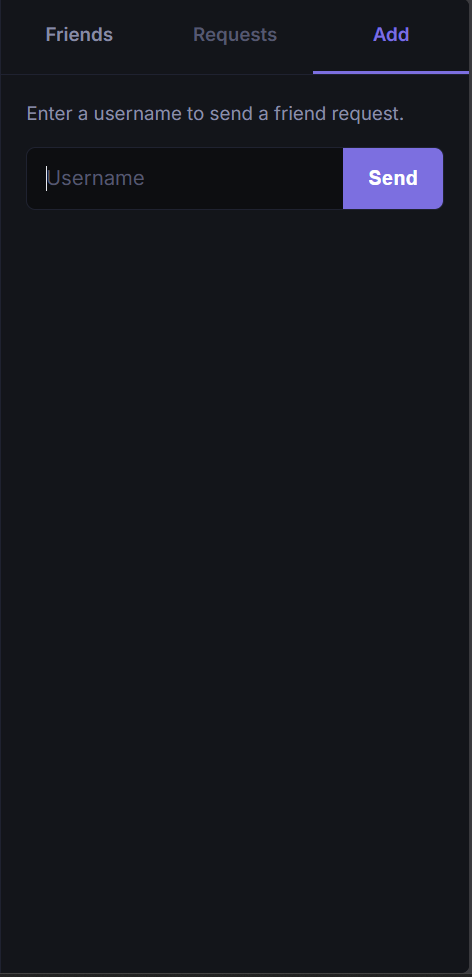
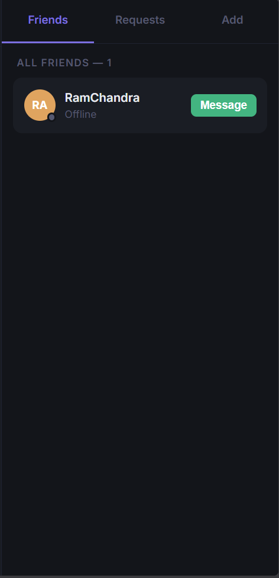

# Real-Time Chat System (FastAPI + WebSockets)

## Overview
A real-time chat application built using FastAPI and WebSockets supporting user authentication and live messaging.

## Features
- Real-time messaging using WebSockets
- JWT authentication
- User-to-user private chats
- Connection manager for active sessions

## Tech Stack
- Backend: FastAPI (Python)
- Database: PostgreSQL (or whatever you used)
- Auth: JWT
- WebSockets


##  Architecture

```text
                ┌────────────────────┐
                │    Client App      │
                │(Browser / Frontend)|
                └─────────┬──────────┘
                          │ WebSocket / HTTP
                          ▼
                ┌────────────────────┐
                │  FastAPI Backend   │
                │   (main server)    │
                └─────────┬──────────┘
                          │
        ┌─────────────────┼──────────────────┐
        │                 │                  │
        ▼                 ▼                  ▼
┌──────────────┐  ┌──────────────┐  ┌──────────────┐
│ Auth Layer   │  │ Connection   │  │ API Routes   │
│ (JWT verify) │  │ Manager      │  │ (REST APIs)  │
└──────┬───────┘  └──────┬───────┘  └──────┬───────┘
       │                  │                  │
       └──────────┬───────┴──────────┬──────┘
                  ▼                  ▼
           ┌────────────────────────────┐
           │     Service Layer          │
           │ (Message / User logic)     │
           └──────────┬─────────────────┘
                      ▼
           ┌────────────────────────────┐
           │        Database            │
           │      PostgreSQL            │
           └────────────────────────────┘
```

## 📸 Demo

### Login Screen


### Chat Interface



### Adding Friends


### Friend List



## How to Run
1. Clone repo
2. Install dependencies
3. Run backend ("uvicorn app.main:app --reload")
4. Start frontend (if any)

## What I Learned
- WebSocket lifecycle management
- Stateless authentication using JWT
- Handling concurrent connections
